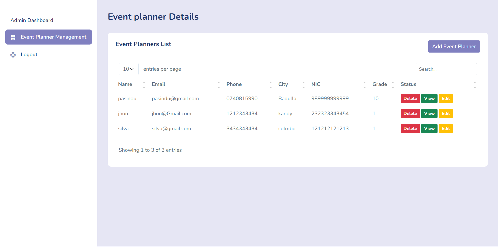

# 🎉 Event Planning Management System

An advanced and intuitive system to streamline event planning, scheduling, and management. Developed using **Java**, **HTML**, **CSS**, and **JavaScript**, this system ensures efficient handling of event-related tasks, making planning effortless and stress-free.

---


## 📸 Dashboard Preview

---

## 🎥 Demo Video
Check out the [demo video](https://mysliit-my.sharepoint.com/:v:/g/personal/it22546784_my_sliit_lk/EXLKccqASUFEqIRqi7KCYsEBr5kszy9qyhKvhjRezl7zug?e=OD9I8p) to see the system in action.

---

## 🛠️ Features
- **Event Management**: Create, update, and delete events with ease.
- **User-Friendly Dashboard**: A visually appealing and interactive dashboard to manage all your tasks.
- **Custom Scheduling**: Assign tasks and set deadlines for seamless event execution.
- **Client Management**: Keep track of client information and communication history.
- **Real-Time Updates**: Automatic updates for changes in schedules or tasks.

---

## 🏗️ Built With
- **Frontend**: HTML, CSS, JavaScript
- **Backend**: Java

---

## 🚀 Getting Started
### Prerequisites
- **Java Development Kit (JDK)** installed.
- A modern web browser.

### Steps to Run:
1. Clone the repository to your local machine:
   ```bash
   git clone https://github.com/<Your-Username>/event-planning-system.git
